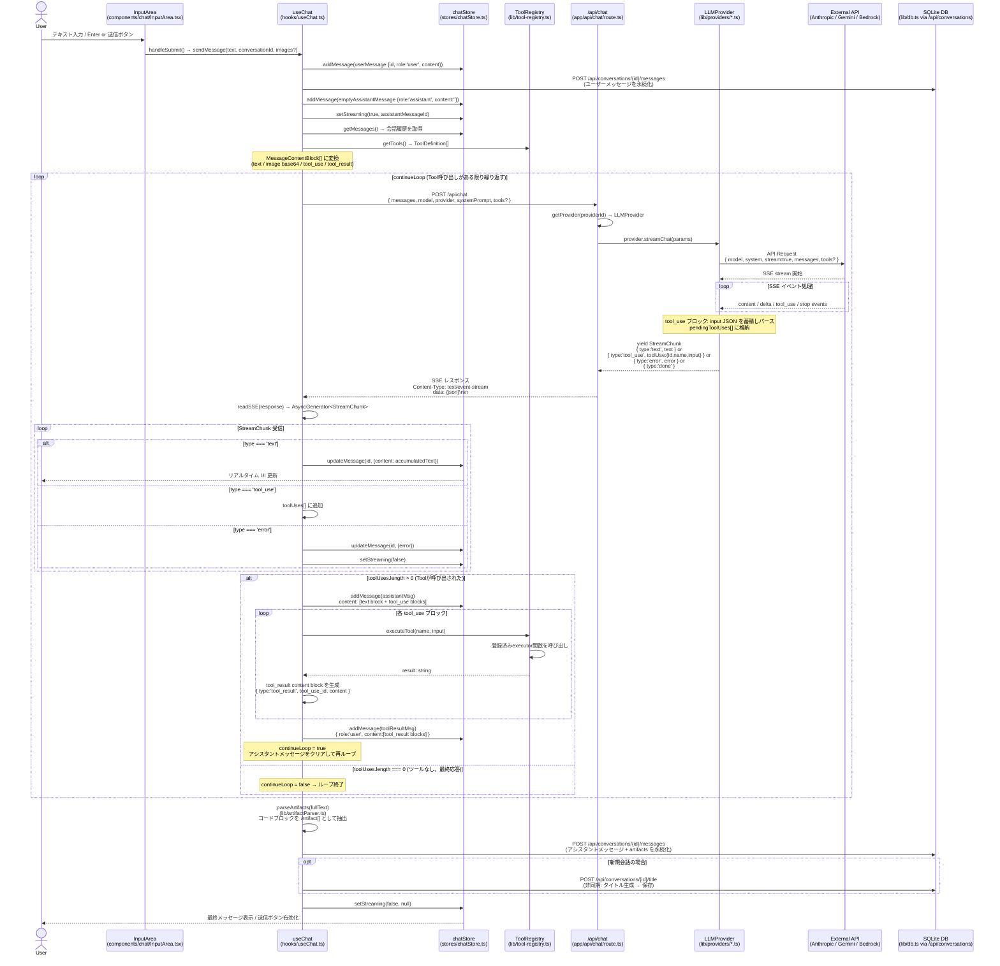

# Chat Request Sequence Diagram

チャット開始からLLMへのリクエスト、Tool呼び出し、結果返却までの処理フロー（実装レベル）



## 主要ファイル対応表

| 処理ステップ | ファイルパス |
|---|---|
| ユーザー入力 | `src/components/chat/InputArea.tsx` |
| チャット制御ロジック | `src/hooks/useChat.ts` |
| 状態管理 (Zustand) | `src/stores/chatStore.ts` |
| ツール定義・実行 | `src/lib/tool-registry.ts` |
| API ルートハンドラ | `app/api/chat/route.ts` |
| プロバイダ選択 | `src/lib/providers/index.ts` |
| Anthropic 実装 | `src/lib/anthropic.ts` |
| Gemini 実装 | `src/lib/providers/gemini.ts` |
| Bedrock 実装 | `src/lib/providers/bedrock.ts` |
| Scripted 実装 | `src/lib/providers/scripted.ts` |
| プロバイダ共通インターフェース | `src/lib/llm-provider.ts` |
| アーティファクト抽出 | `src/lib/artifactParser.ts` |
| DB アクセス | `src/lib/db.ts` |
| 会話 API | `app/api/conversations/[id]/route.ts` |

## StreamChunk 型定義 (`src/lib/llm-provider.ts`)

```typescript
export interface StreamChunk {
  type: 'text' | 'tool_use' | 'done' | 'error';
  text?: string;
  error?: string;
  toolUse?: { id: string; name: string; input: Record<string, unknown> };
}
```
