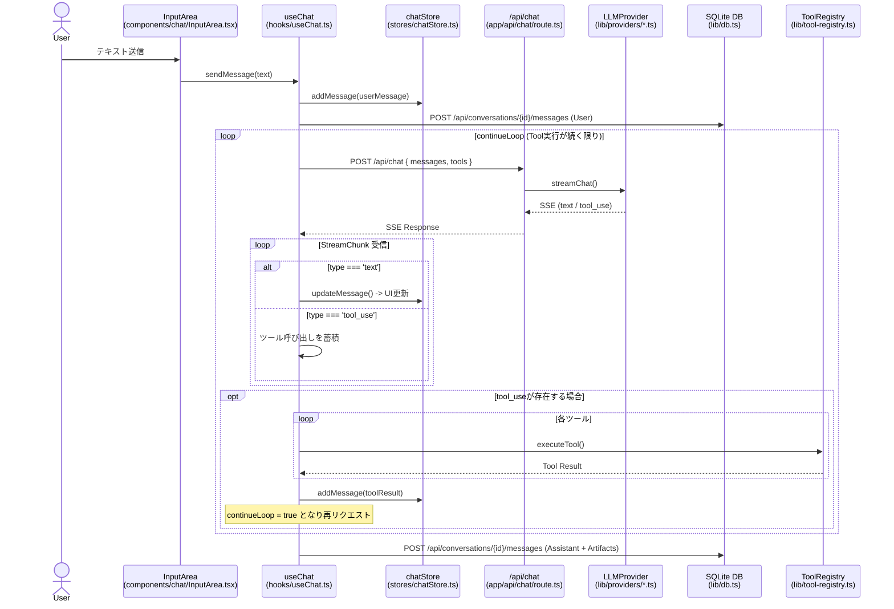
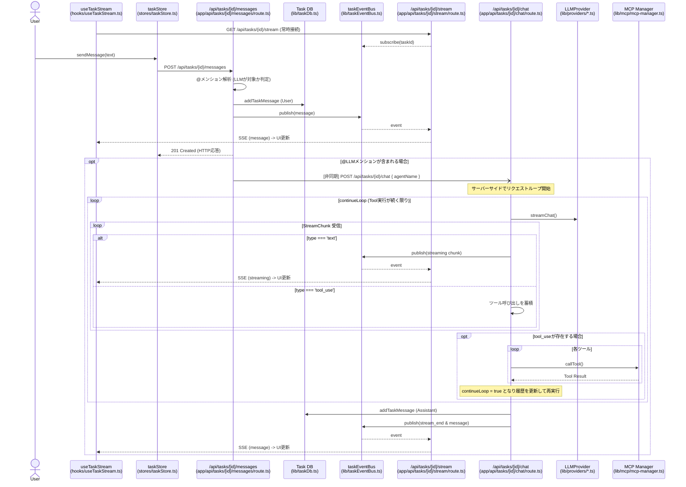

# 通常チャット機能とタスク機能のアーキテクチャ比較・シーケンス図

本ドキュメントでは、通常のチャット機能とタスク機能におけるエージェント（LLM）との対話フローの違いをファイル単位で比較し、Mermaid形式のシーケンス図で示します。

## 1. 通常チャット（Standard Chat）のシーケンス

通常のチャットは、「1ユーザー対1つのLLM」の同期的なRequest-Responseモデルに基づいています。クライアントが直接LLMの応答を待ち受け、状態管理やツール実行の調整をクライアント側（フロントエンド）が主体となって行います。

## 2. タスク機能（Task Chat）のシーケンス

タスク機能は、複数ユーザー・複数LLMエージェントが参加する非同期・イベント駆動モデルです。クライアントはメッセージを送信するだけで、メンション解析やLLMの呼び出し、ツール実行（MCP）などの複雑な処理はすべてバックエンドで完結し、結果がSSE（Server-Sent Events）を通じて全クライアントにブロードキャストされます。

## 3. 両者のアーキテクチャの違いと分析

### 1. 通信モデルと状態管理の主体

*   **通常チャット**:
    *   **同期的なRequest-Response**: `useChat`フックが直接LLMのストリーミング応答を待ち受けます。
    *   **クライアント主導**: 途中経過のメッセージ状態（Streaming状態やTool Useの中間状態）はZustandストアで管理され、通信完了後にクライアントからDBへ保存リクエストが送られます。
*   **タスク機能**:
    *   **非同期・イベント駆動 (Pub/Sub)**: メッセージ送信(`POST /messages`)と受信(`/stream`)が分離されたCQRS的な設計です。送信APIは即座にレスポンスを返し、実際のLLM処理はバックエンドで非同期に走ります。
    *   **バックエンド主導**: LLMからの応答、中間状態、Tool実行は全てサーバー側(`POST /chat`)で完結します。結果は`taskEventBus`経由でイベントとして全クライアントに配信されます。

### 2. ツール（Tool/Function Calling）の実行場所

*   **通常チャット**:
    *   ツールはクライアントサイド（ブラウザ）上で実行されます。APIから`tool_use`ブロックを受け取ると、フロントエンドの`ToolRegistry`を通じて関数が実行され、その結果を含めて再度APIにリクエストを投げます。
*   **タスク機能**:
    *   ツールはサーバーサイドで実行されます。特にMCP（Model Context Protocol）によるファイル出力などは、バックエンドの`mcpManager`を通じて処理されます。これにより、隔離されたタスクワークスペースに対する安全なファイル操作が可能になっています。

### 3. メッセージの永続化タイミング

*   **通常チャット**:
    *   ユーザーの発言は送信時に保存され、LLMの応答はストリーミングが**完了した後**にフロントエンドから`/api/conversations/[id]/messages`へPOSTすることで初めてDBに保存されます。通信切断時にデータが失われるリスクがあります。
*   **タスク機能**:
    *   LLMの応答完了時、サーバー側の`/api/tasks/[id]/chat`ルートが**直接Task DBに書き込みます**。その後、保存された完全なメッセージがSSEで配信されるため、データの一貫性と耐障害性が高くなっています。

### 4. 参加者のスケーラビリティ

*   **通常チャット**:
    *   1対1の設計であるため、他のユーザーや複数のLLMモデルを同じスレッドに介在させることはできません。
*   **タスク機能**:
    *   サーバー側の`taskEventBus`による状態共有と、宛先解決（`@メンション解析`）により、複数人が同時に書き込み、複数のLLMエージェントが順次または並列に反応できる構造になっています。
